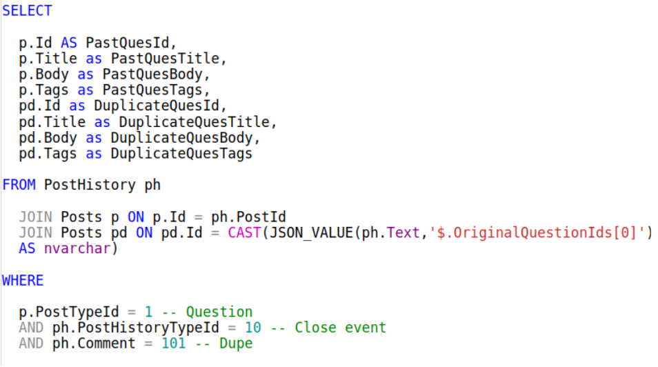
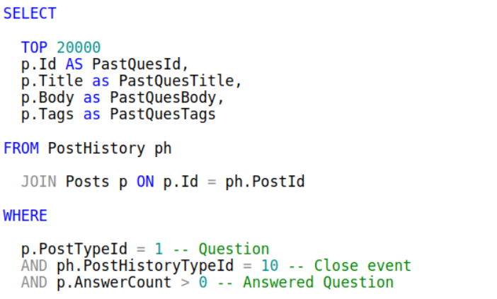
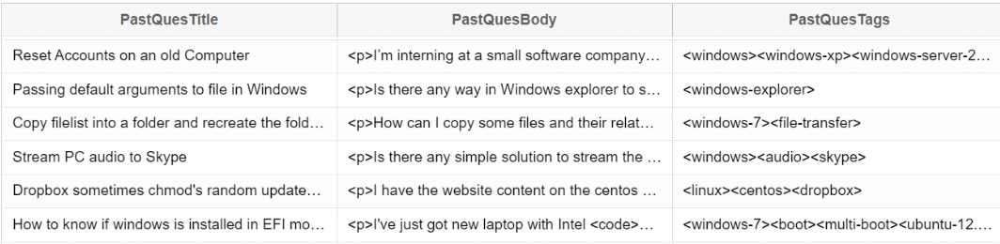
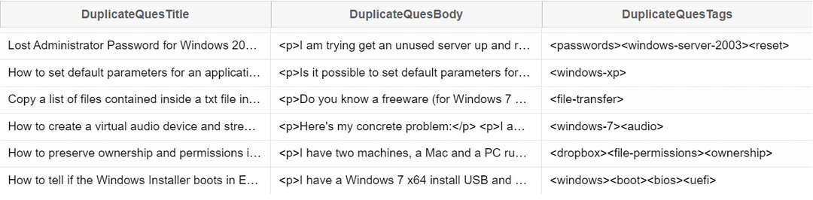
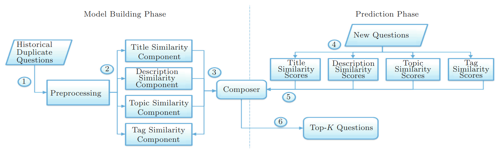

---
geometry:
- top=25mm
- left=25mm
- right=25mm
- heightrounded
...

## Introduction and Motivation

Stack Overflow is an online platform for people to ask questions regarding specific subjects. Due to its massive popularity and userbase, the platform faces far too many questions a day, and a lot of them could be classified as duplicates. A human would take unimaginably long to go through the entire database and flag each question as a duplicate, and duplicates will not be answered quickly either, as people get tired of answering the same questions. Clearly, the manual approach is unfeasible and has many flaws, and a better solution is required. This is where the paper “Multi-Factor Duplicate Question Detection in Stack Overflow” by Y. Zhang et al. comes in. The paper proposes a model that is able to take a new question from a user as an input, compute certain weighted measures and give a list of k questions that are most similar to the input question. The similarity score is calculated and then used as a metric for ranking and creating the output list. The model is trained on a dataset of 1.5 million questions, and is able to give a list of 10 similar questions in less than 1 second. The model is implemented using Python due to its extensive library support. We also train and test the model on a smaller dataset due to hardware limitations, however the model has the same architecture and hence, should scale well. We conclude by showing results and listing some limitations.

## Dataset

The dataset for the predictor is taken from [Stack Exchange Data Explorer for Superuser](https://data.stackexchange.com/superuser). A set of 20,000 questions are taken along with 8811 past question and duplicate pairs. 

For every question four fields are taken into consideration, namely Question ID, Title, Tags and Body. 

The queries to get the dataset for duplicate questions are as follows:



To find duplicate questions we are checking if the question has been closed and checking if the reason for closing was ‘Duplicate’ (i.e ph.Comment = 101).

To get the main dataset of past questions, we run the following queries.



The questions we obtain are shown below.





All have 4 fields: Title, Body, Tags, ID
We have 8000 past and duplicate question pairs, along with 20000 top questions. All of them will not be used purely because of hardware constraints. We will be using 150 past and duplicate question pairs as suggested in the paper, along with 5000 top questions for training the model.

## Implementation

Our implementation follows closely with the implementation provided in the paper. The flowchart below summarizes our approach.



We first train the model on the dataset as we are required to and obtain the parameters. We then store the parameters in a file, after which we only read the weights from the file and use them to compute the similarity between two questions. This is done to save time and avoid retraining the model every time we want to predict the similarity between two questions. The model on average runs in around 13 seconds with the weights given, however it took about an hour to train entirely with the specified dataset sizes. The trained parameters are stored in `trained_params.txt`. We have used the `tqdm` library to show the progress of the model when run with a new input question, and to give the user a real-time estimate of the amount of time it would take for the code to run.

## Preprocessing 

The questions that were retrieved from stack exchange data explorer were first processed into a workable form. The following steps were taken to preprocess the data.

First, using inbuilt Python libraries, the questions were converted from HTML to text and any links in the question were removed. The questions were also tokenized.

After tokenising, we use the gensim library to remove stopwords. Stop words are commonly occurring words like 'a', 'and', 'the', which do not add a contextual meaning to the sentence. These words are removed as they do not help in differentiating between questions.

The questions are also stemmed using the Porter Stemmer algorithm (part of the gensim library) as recommended by the paper. Stemming is the process of reducing words to their root form. For example, 'running' and 'runs' can be reduced to 'run'.

## Similarity Scores

For each known duplicate question, we compare it with every other question. We compute four similarity scores based on the following parameters for each of these pairs; Title, Tags, Description, and Topic Similarity. 

After preprocessing, each component is represented as a bag of words, for example, $TitleBag_n$ and $TitleBag_m$ . We then take the union of these bags to eliminate duplicates and create a set: $TitleBag_u$.

We then use vector space modelling to represent the two titles as vectors as follows: 

$$TitleVec_m = (wt_{m,1}, wt_{m,2}, .... wt_{m,v})$$

Where the $wt_{m,q}$ is the  relative term frequency of the qth word in the mth question's title, which is computed as follows:

$$wt_{m,q} = \frac{n_{m,q}}{\displaystyle\sum_i n_{q, i}}$$

Where $n_{m,q}$ is the term frequency of the qth word in the mth question's title.

We then compute the similarity between two titles by calculating the cosine similarity of their vectors. The same process is used to calculate scores for tag and description.

$$TitleSim(TitleVec_m, TitleVec_n) = \frac{TitleVec_m\cdot TitleVec_n}{|TitleVec_m||TitleVec_n|}$$

The denominator is the magnitude of the vector, which is the square root of the sum of the squares of the elements of the vector.

$$|TitleVec_m| = \sqrt{\sum_i wt_{m, i}^2}$$

To calculate the topic similarity scores we use a topic model: LDA (Latent Dirichlet Allocation). We input the preprocessed title and descriptions of the questions to the LDA model and generate the topic distributions of each question.

A topic distribution for a question, d, can be represented as follows: 

$$T_d = (p_{d,1} , p_{d,2} ... p_{d,t})$$

Where each $p_{d,i}$ represents the probability that question d belongs to that topic.We then use these vector to compute the cosine similarity score (using the same method as title).

We have used Python's gensim library to train the LDA and get the topic distributions. We have used 50 topics for the LDA model. 

## Composer

### Training

The composer is where the model, consisting of the four parameter weights, is trained. This is done in the following steps:

1. Calculate all 4 similarity scores for every duplicate question and question pair
2. Initialise all 4 weights to a random number in [0,1].
3. Take the first weight $\alpha$, vary it starting at 0 in increments of 0.01.
4. Evaluate the composer score for every duplicate question (d) and question (q) pair according to the expression: $$Composer\ Score = \alpha TitleSim_{d}(q) + \beta TagSim_d(q)+\gamma  DescSim_d(q)+\delta TopicSim_d(q)$$
5. Evaluate the evaluation criterion (Taken to be the $recall-rate@20$ like the paper) of the model.
6. If EC score is better than the previous best, then update the current best value of the weight to the present value. 
7. Do the same for $\beta,\gamma,\delta$.
8. This is one iteration.
9. Do this for multiple iterations.
10. For every weight, the value with highest EC score across iterations is chosen as the final trained weight.

#### Recall-Rate@20

Given by 

$$\frac{N_{detected}}{N_{total}}$$

Where $N_{detected}$ is the number of duplicate questions whose masters (i.e., original questions that are posted earlier in Stack Overflow) appear in the list of top-20 questions and $N_{total} $ is the total number of duplicate questions used for testing.

### Prediction

For every new query question, we calculate the composer score with every other question. The questions corresponding to the top 20 composer scores are displayed as the final output.

## Training the Model

To train the model, we run it on all the data we obtained from the data explorer, to get the best weights as specified in the paper. The `main.py` file has commented lines that can be uncommented to retrain with different parameters, after changing the size literals of the dataset in the `parse.py` file. 

## Testing the Model

To test the model, we simply run `main.py`, which then calls the `prediction.py` file. The user is then prompted to enter a question, its tags and its description, which are then preprocessed and used to calculate scores with all questions in the dataset we have at hand. The top 20 questions (ranked according to their similarity score as calculated by the composer) are then displayed to the user along with their universal question ID from stack overflow. The user can then go through these questions and check if there is a match. THe software is simply suggestive in this manner.

## Interface

The interface of our software is a simple CLI, that accepts three inputs from the user. Testing can be done by the two default question files provided in the repository which are in `input.txt` and `input2.txt`, which can be redirected when running the code. The output is displayed in the terminal itself.

Command to run the software:

```bash
python3 main.py < input.txt
```

## Results

The outputs for the two given input files are shown below. The weights are permanently stored after the training process in `trained_params.txt`, which is read by the `prediction.py` file.


The outputs are as expected, similar to the given input. The accuracy can be improved by training the model on more past questions to improve the weights.

## Limitations

The model is limited by the dataset it trains on, and limiting it will greatly restrain its accuracy. It also suffers from bias in training the weights due to the order in which the weights are trained. This has been addressed in the paper by training the weights iteratively and by initialising all weights to random numbers at the beginning of each iteration, to help find the optimal set of weights. 

## Link to the GitHub Repository

<https://github.com/KarthikL1729/DupPredictor-22>

## References

- Multi-Factor Duplicate Question Detection on Stack Overflow, 2015, Y. Zhang et al. 

---